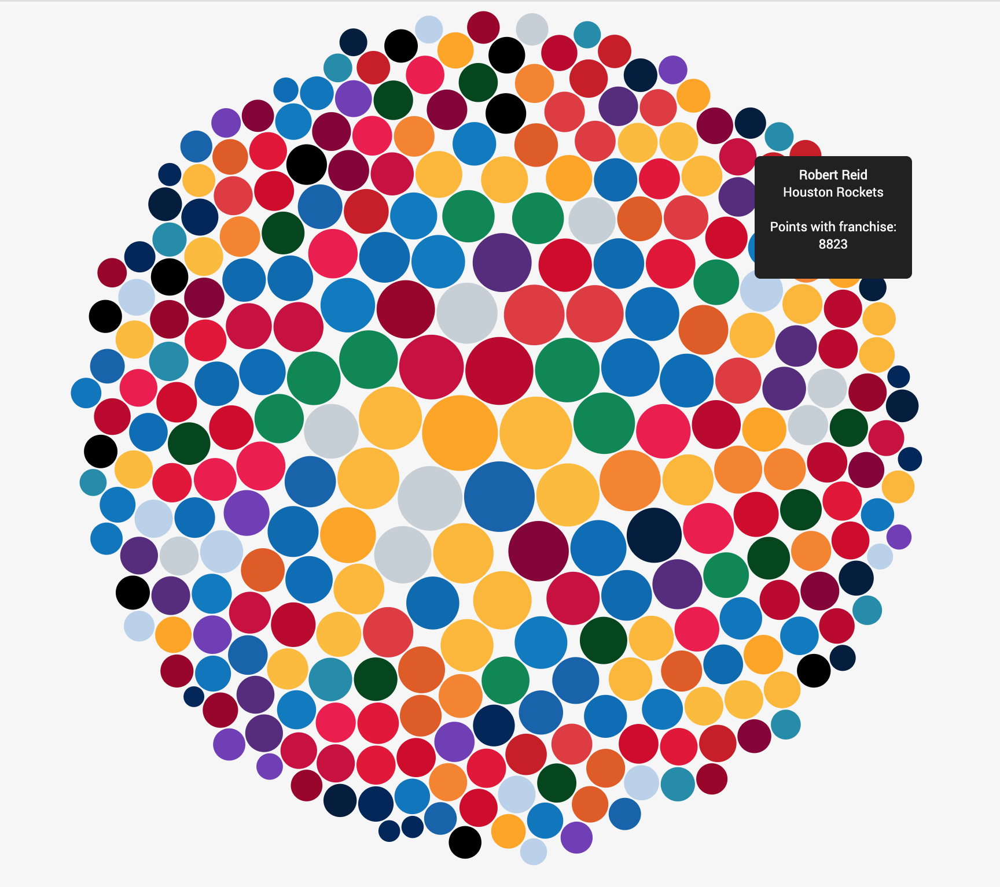

# scoring-leaders-by-nba-team

<b>Setup</b>

In order to run this page, you need to start a local server on python.

The best way to start the server is by going to the terminal and type:

python -m http.server (for python 3) 

python -m SimpleHTTPServer (for python 2) 

After typing the command, the terminal should indicate which port the page can be opened.

Typically, you can get to the page by going to your preferred browser and typing:

localhost:8000

